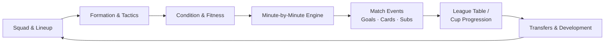
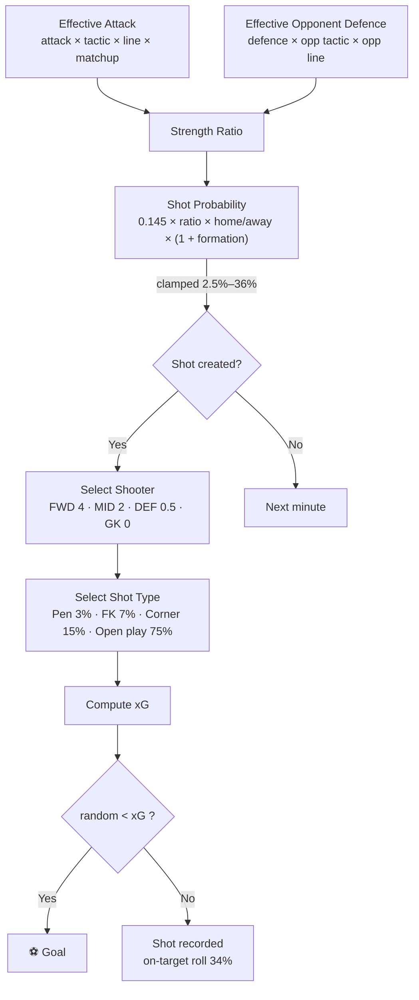
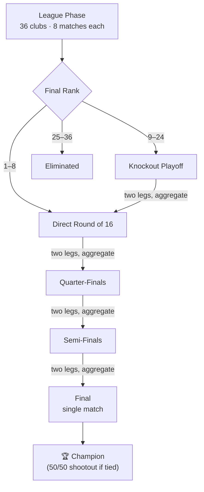

<div align="center">

# ⚽ Football Simulation

### A probabilistic football management sim — five leagues, domestic cups, a 36-team Champions League, and a minute-by-minute match engine built on real tactical math.

[](https://react.dev)
[](https://vitejs.dev)
[](#-game-structure)
[](#-champions-league)
[](#-the-match-engine)
[](#-club-management)
[](#-license)

</div>

---

## 📚 Table of Contents

- [Overview](#-overview)
- [Features](#-features)
- [Tech Stack](#-tech-stack)
- [Quick Start](#-quick-start)
- [Game Structure](#-game-structure)
- [The Match Engine](#-the-match-engine)
  - [Lineup Strength](#lineup-strength)
  - [Team Attack & Defence](#team-attack--defence)
  - [Formation Matchups](#formation-matchups)
  - [Tactical Styles](#tactical-styles)
  - [Defensive Line & Offside Trap](#defensive-line--offside-trap)
  - [Minute-by-Minute Pipeline](#minute-by-minute-pipeline)
  - [Shooter Selection & Shot Type](#shooter-selection--shot-type)
  - [Expected Goals (xG)](#expected-goals-xg)
  - [Fouls, Cards & Offsides](#fouls-cards--offsides)
  - [Possession](#possession)
  - [Fitness](#fitness)
- [Competitions](#-competitions)
- [Club Management](#-club-management)
- [Why a Strong Team Can Still Lose](#-why-a-strong-team-can-still-lose)
- [Roadmap](#-roadmap)
- [License](#-license)

---

## 📖 Overview

**Football Simulation** is a browser-based club management game — pick a team, set your tactics, and play (or fast-forward) through full seasons across five European leagues, domestic cups, and a Champions League. Every match is resolved **minute by minute**, run through a layered model of player condition, formation matchups, tactical style, defensive line, home advantage, and expected goals (xG), so results feel earned rather than rolled on a single dice.

<div align="center">



*The season loop: every match feeds back into squad development, transfers, and next season's lineup.*

</div>

---

## ✨ Features

| | |
|---|---|
| 🏆 **Five leagues** | Premier League, La Liga, Serie A, Bundesliga, Ligue 1 |
| 🥇 **Domestic cups** | FA Cup & Carabao Cup (PL), Copa del Rey (La Liga) |
| 🌍 **Champions League** | 36-team league phase + two-legged knockouts |
| 🔁 **Transfers & loans** | Buying, selling, loaning, squad limits, shirt numbers |
| 📈 **Player development** | Age- and appearance-based growth/decline across seasons |
| 🧩 **Tactical control** | Drag-and-drop lineups, formations, tactics, defensive line |
| 🩹 **Fitness system** | Live condition loss, automatic substitutions, suspensions |
| ⏱️ **Flexible pacing** | Match-by-match simulation or instant half-season sim |
| 📊 **Live match centre** | Club-colour themed momentum, possession, shot map, ratings |
| 💾 **Persistence** | Local autosave, JSON export/import, save migration |

---

## 🛠️ Tech Stack

<div align="center">


</div>

- **Frontend:** React 18 (function components + hooks) with [`lucide-react`](https://lucide.dev) icons
- **Build tool:** Vite 5
- **Linting:** ESLint 9 with React/React-Hooks/React-Refresh plugins
- **Game logic:** a self-contained engine (`src/game/`) decoupled from the UI layer — `engine.js`, `career.js`, `actions.js`, `storage.js`, `uclBracket.js`, `uclSelection.js`
- **Testing:** a dedicated test suite in `/tests`

```
football-simulation/
├── tests/
│   └── game.test.js
└── game-app/
    ├── public/
    ├── src/
    │   ├── assets/
    │   │   ├── club-logos/          # 100+ club crests
    │   │   └── competition-logos/   # PL · La Liga · Serie A · Bundesliga · Ligue 1 · UCL
    │   ├── components/
    │   │   ├── LiveMatchScreen.jsx
    │   │   └── CompetitionBrand.jsx
    │   ├── data/
    │   │   └── players.js
    │   ├── game/
    │   │   ├── engine.js            # core match simulation
    │   │   ├── career.js            # season progression
    │   │   ├── actions.js           # transfers, squad actions
    │   │   ├── config.js
    │   │   ├── storage.js           # autosave / import-export
    │   │   ├── uclBracket.js
    │   │   ├── uclSelection.js
    │   │   ├── matchVisuals.js
    │   │   └── standingsZones.js
    │   └── App.jsx
    └── package.json
```

---

## 🚀 Quick Start

```bash
# clone the repo
git clone https://github.com/jzc9307/football-simulation.git
cd football-simulation/game-app

# install dependencies
npm install

# run the dev server
npm run dev

# build for production
npm run build

# lint
npm run lint
```

---

## 🏟️ Game Structure

| League | Clubs | Matches | Domestic Cup |
|---|---:|---:|---|
| 🏴 Premier League | 20 | 38 | FA Cup, Carabao Cup |
| 🇪🇸 La Liga | 20 | 38 | Copa del Rey |
| 🇮🇹 Serie A | 20 | 38 | — |
| 🇩🇪 Bundesliga | 18 | 34 | — |
| 🇫🇷 Ligue 1 | 18 | 34 | — |

---

## 🧠 The Match Engine

### Lineup Strength

Every player gets an effective rating from **position fit** × **condition**.

**Position fit:**

| Position usage | Contribution |
|---|---:|
| Exact position | 100% |
| Compatible position | 96% |
| Emergency/incompatible | 78% |

**Condition curve:**

```
Adjusted rating = OVR × (0.65 + 0.35 × condition / 100)
```

| Condition | OVR contribution |
|---:|---:|
| 100% | 100% |
| 95% | 98.25% |
| 90% | 96.5% |
| 80% | 93% |

A valid lineup needs 11 distinct starters, a goalkeeper in goal, and no suspended players — otherwise the simulator blocks the match.

### Team Attack & Defence

```
Attack  = (forward avg × 1.3 + midfield avg × 0.9) / 2.2
Defence = (GK avg × 0.9 + defender avg × 1.2 + midfield avg × 0.5) / 2.6
```

Both scale by `min(1, available players / 11)` — a red card doesn't just remove a player from events, it weakens the *entire team's* attack and defence.

### Formation Matchups

```
Wide advantage           = (my wide attackers + wide mids − opp wide defenders) × 0.03
Central attack advantage = (my central attackers − opp central defenders) × 0.035
Midfield advantage       = (my central mids − opp central mids) × 0.035
```

Each component caps at ~±9%; the combined formation modifier caps at **±20%**. This shapes **shot frequency**, not goals directly.

### Tactical Styles

| Style | Attack | Defence |
|---|---:|---:|
| Balanced | 0% | 0% |
| Tiki-Taka | +4% | +2% |
| Gegenpress | +7% | +4% |
| Low Block | −10% | +14% |
| Counter Attack | +3% | +5% |
| Direct Play | +2% | −2% |

**Matchup bonuses** (rock–paper–scissors layer on top):

| Tactic | Beats | Bonus |
|---|---|---:|
| Gegenpress | vs Tiki-Taka | +6% |
| Counter Attack | vs Gegenpress | +8% |
| Counter Attack | vs Tiki-Taka | +5% |
| Low Block | vs Tiki-Taka | +4% |
| Tiki-Taka | vs Gegenpress / Low Block | −5% |

The AI selects its tactic from formation shape and squad quality (back-line size, striker setup, squad strength). Note: the tactic config carries a `variance` value that the event simulator doesn't currently use.

### Defensive Line & Offside Trap

```
Line position = (selected line − 50) / 50
```

A higher line adds up to ~5% attack at the cost of up to ~6% defence (deeper lines reverse this).

```
Offside trap bonus = 0.05 + ((your defence − opponent attack) / 10) × 0.02   [clamped to −5% … +8%]
```

Strong defences get more value from the trap than weak ones.

### Minute-by-Minute Pipeline

For **every team, every minute**, the engine runs this pipeline:



**Home / away multipliers:** `×1.12` home, `×0.92` away — meaningful but never decisive on its own.

> ⚠️ **Known limitation:** shot type (penalty / free kick / corner / open play) is assigned *after* a shot is generated, independent of the foul system — so a penalty can occur with no recorded foul that minute.

### Shooter Selection & Shot Type

| Player group | Weight |
|---|---:|
| Forward | 4 |
| Midfielder | 2 |
| Defender | 0.5 |
| Goalkeeper | 0 |

| Shot type | Chance |
|---|---:|
| Penalty | 3% |
| Direct free kick | 7% |
| Corner | 15% |
| Open play | 75% |

Weighting uses whoever is currently on the pitch, so red cards and substitutions change who's likely to shoot.

### Expected Goals (xG)

```
Penalty xG = 0.76 (fixed)
Other xG   = 0.10 × strength ratio × random(0.55–1.55)   [clamped to 0.02–0.48]
Goal if    = random() < xG
```

- A shot is a **big chance** at xG ≥ 0.25
- A shot is **on target** if it's a goal, or passes a separate 34% roll

Better teams win twice: more shots **and** higher-quality shots.

### Fouls, Cards & Offsides

| Event | Probability / minute | Expected per team / match |
|---|---:|---:|
| Foul | 12% | ~11.4 |
| Red card | 0.075% | ~6.9% chance of a red somewhere in the match |
| Offside | 2% | ~1.9 |

- Max **one red card** per team per match — the player is removed instantly, team strength recalculates for 10 men, and they're suspended for the competition's next match.
- ⚠️ Yellow cards aren't generated by the live simulator yet (UI support exists, logic doesn't).
- Red-card risk is independent of foul count — fouls don't stack toward a card.

### Possession

```
Passes/minute  = 3 + random(0–3)     [+2 with Tiki-Taka]
Pass accuracy  = random(72%–90%)
Possession wgt = passes × (attack rating / 80)
```

Weights are normalized across both sides into a possession percentage — driven by pass volume, tactic, attacking quality, and player count (10 vs 11).

### Fitness

| Tactic | Condition loss / minute |
|---|---:|
| Gegenpress | 0.43 |
| Everything else | 0.27 |

Live condition floors at 20%. At **minute 60**, up to 3 automatic subs swap the most fatigued starters for the bench player with the best `condition × OVR` (goalkeepers excluded).

**Post-match condition** carried into the next fixture:

```
Normal:     next condition = 100 − minutes played × 0.06
Gegenpress: next condition = 100 − minutes played × 0.08
```

| Minutes | Normal | Gegenpress |
|---:|---:|---:|
| 95 | 94.3% | 92.4% |
| 60 | 96.4% | 95.2% |
| 35 | 97.9% | 97.2% |

Clamped to 82%–100%; unused players recover +12 condition, up to 100%.

> **Balance note:** AI squads generally start matches at database condition (~100%), while your squad carries recent workload. The gap is small (the formula is gentle) but real.

---

## 🏆 Competitions

### League
Win = 3pts · Draw = 1pt · Loss = 0pts. Table sorts by **points → goal difference → goals scored** (no further tiebreaker).

### Domestic Cups
Standard 95-minute result; ties go to a **50/50 shootout calculation** (no extra time, individual takers, or GK ability modeled — yet).

### Champions League



Table sorting mirrors the domestic league rules.

---

## 💼 Club Management

### Transfers & Loans

| Rule | Value |
|---|---:|
| Max squad size | 30 |
| Max incoming loans | 3 |
| Buying price | 100% of value |
| Selling income | 90% of value |
| Loan fee | 10% of value |
| Min squad after sale | 16 players + 1 GK + usable XI |

Loaned players return to their owner at season end and can't be re-sold or re-loaned. Shirt numbers use the lowest number free from 1–99. Market opens preseason and at the midpoint window.

### Player Development *(end of season)*

- Everyone ages +1
- Under-24s with 10+ appearances → **+1 OVR**
- Age 32+ → **−1 OVR**
- Ratings clamped to **45–95**
- Value: **+8%** on a rise, **−10%** on a drop, unchanged otherwise
- Condition resets to 100%, appearances reset to 0

### New-Season Budget

```
Grant = £10m + ((clubs in league − final rank + 1) × £2m)
```

| Finish (20-team league) | Grant |
|---|---:|
| 🥇 Champion | £50m |
| 2nd | £48m |
| 10th | £32m |
| 20th | £12m |

---

## 🎲 Why a Strong Team Can Still Lose

The engine is deliberately probabilistic — a better squad creates more shots *and* higher-quality chances, but never a guaranteed result. Losses can come from random finishing, an opponent overperforming low xG, away disadvantage, formation/tactical mismatches, poor condition, a red card, a misused position, an exposed high line, or a run of bad luck. Calibration keeps elite squads dominant *on average* over a season — Liverpool finishing 19th should now be a freak outcome, not a normal one — while still leaving room for the occasional shock result.

---

## 🚧 Roadmap

- [ ] Connect fouls → cards → penalties/free kicks into one causal event chain
- [ ] Implement yellow cards in the live simulator
- [ ] Model extra time and individual penalty-shootout takers
- [ ] Put the (currently unused) tactic `variance` value to work
- [ ] Narrow the AI-vs-human condition gap (AI starts near 100%, your squad carries real workload)

---

## 📄 License

Add your license here.

<div align="center">

Made with ⚽ and a lot of xG math.

</div>
