<div align="center">

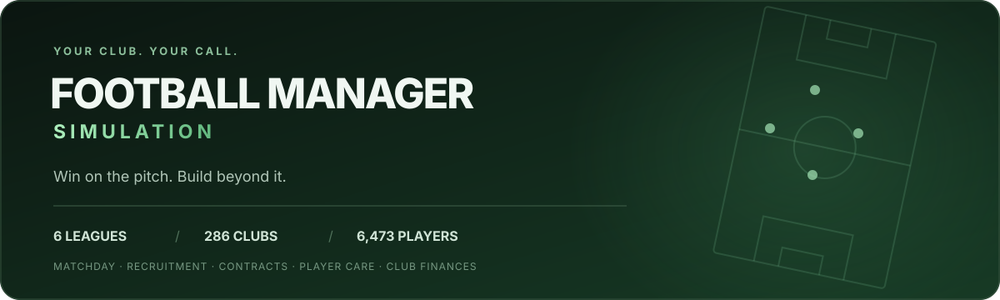

<h1>Football Manager Simulation</h1>

<p><strong>Build a club. Shape a squad. Make every decision count.</strong><br />
A browser-based football career with live match simulation, intelligent recruitment,<br />
contract negotiations, player relationships and connected club finances.</p>


<p>
<a href="#quick-start">Quick start</a> ·
<a href="#gameplay-gallery">Gameplay gallery</a> ·
<a href="#the-connected-career">Explore the systems</a> ·
<a href="game-app/docs/GAMEPLAY.md">Gameplay guide</a> ·
<a href="game-app/docs/CALCULATIONS.md">Calculations</a> ·
<a href="game-app/README.md">Developer guide</a>
</p>

<sub>Documentation and test badge audited against the implementation on 30 September 2026.</sub>

</div>

---

> One career. Six football countries. Decisions that follow you beyond the next match.
>
> This is a fan-made simulation, not an EA product. Results, emotions, financial allocations and transfer outcomes are game calculations. Imported FC26 terms are attributed game-database values, not verified current legal contracts. This guide describes implemented features, not a promised roadmap.

## At a glance

| The football world | Your management tools | A career that remembers |
| --- | --- | --- |
| 6 playable top flights | Matchday Studio and 3 team sheets | Persistent opponent energy and sharpness |
| 286 clubs, including European guests | Club fees, rival bids and personal terms | Contracts, promises and playing-time history |
| 6,473 unique player slugs | Squad Hub, Performance Centre and Mail | Multi-season player and club records |
| League, domestic cups and 3 European competitions | Budgets, wages, rewards and board objectives | Local saves, recovery and JSON backups |

## Contents

- [Quick start](#quick-start)
- [Gameplay gallery](#gameplay-gallery)
- [The connected career](#the-connected-career)
- [World, competitions and calendar](#world-competitions-and-calendar)
- [The management dashboard](#the-management-dashboard)
- [Squad selection, tactics and team sheets](#squad-selection-tactics-and-team-sheets)
- [Match simulation, fatigue and substitutions](#match-simulation-fatigue-and-substitutions)
- [Performance Centre and Squad Hub](#performance-centre-and-squad-hub)
- [Transfers and the intelligent market](#transfers-and-the-intelligent-market)
- [Contracts and squad-role negotiation](#contracts-and-squad-role-negotiation)
- [Playing time, happiness and player meetings](#playing-time-happiness-and-player-meetings)
- [Club finances and competition rewards](#club-finances-and-competition-rewards)
- [Assistant advice and board objectives](#assistant-advice-and-board-objectives)
- [Deadline Day](#deadline-day)
- [Season progression](#season-progression)
- [Loading, saves, recovery and restart](#loading-saves-recovery-and-restart)
- [Development and documentation](#development-and-documentation)

Diagrams use Mermaid, which GitHub renders directly. In other Markdown viewers, the text and tables remain readable even if diagram rendering is unavailable.

## Quick start

```sh
cd game-app
npm install
npm run dev
```

Open the local URL printed by Vite. Pick a league, open a club dossier, select your club and choose a season format.

| Mode | How it plays | What remains under your control |
| --- | --- | --- |
| Match by Match | Prepare and simulate fixtures individually, following the next scheduled event | Selection, tactics, transfers, contracts and player decisions |
| Instant Half-Season | Advance fixture-by-fixture toward the halfway or final review | The same tools; fast-forward pauses for manager-relevant events |

Instant mode is **not** permission for the AI to sell your players or skip an important offer. Both modes share the same calendar, world fixtures, medical state, records and financial clock.

## Gameplay gallery

Actual screens from the running game—not concept art. These previews were captured on 30 September 2026 in a separate demo career. Clubs, budgets, dates and statistics reflect that simulated save, not current real-world results. Select any image to open the full-size preview.

### A transfer market you can explore

[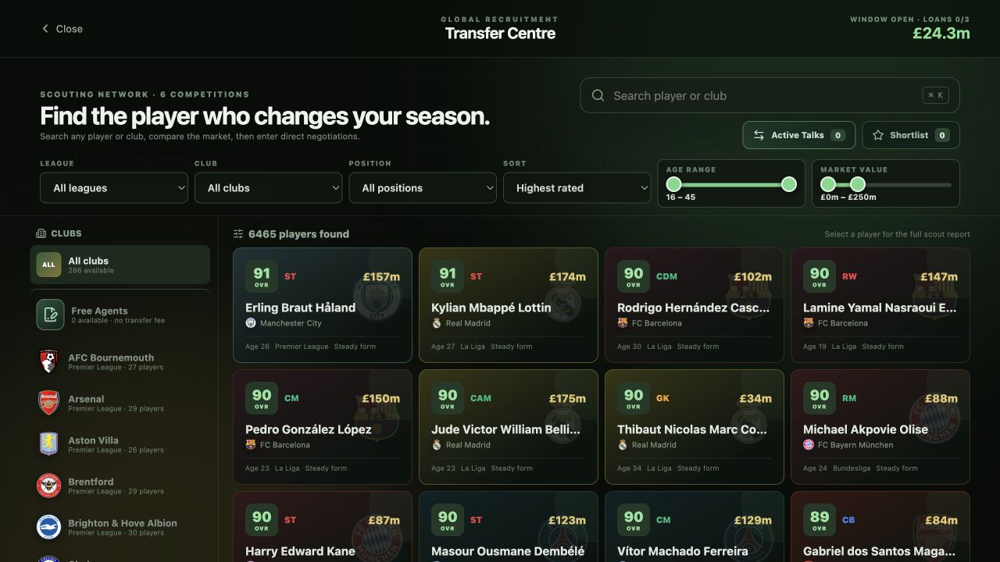](docs/screenshots/transfer-centre.png)

Search the football world, narrow your shortlist and open a full scout report before entering negotiations. [Explore the transfer system →](#transfers-and-the-intelligent-market)

<table>
<tr>
<td width="50%" valign="top">
<a href="docs/screenshots/matchday-studio.png">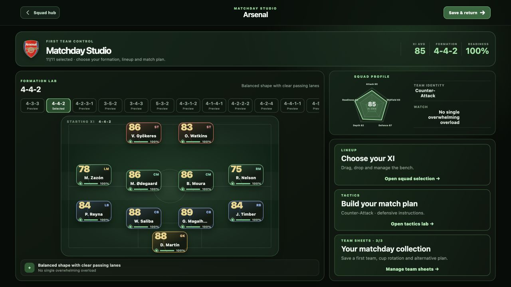</a>
<p><strong>Matchday Studio</strong><br />Formation, lineup and match plan in one workspace. <a href="#squad-selection-tactics-and-team-sheets">See how it works →</a></p>
</td>
<td width="50%" valign="top">
<a href="docs/screenshots/squad-hub.png">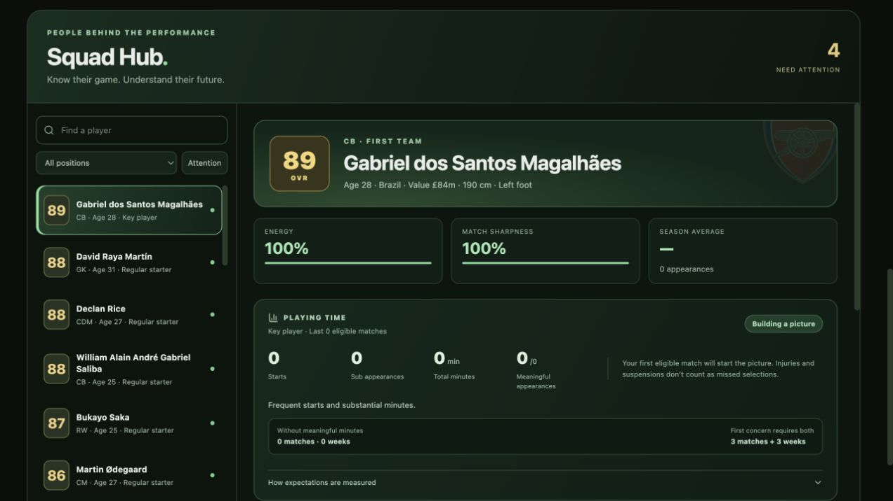</a>
<p><strong>Squad Hub</strong><br />Know the player and see their involvement against expectations. <a href="#performance-centre-and-squad-hub">Explore the hub →</a></p>
</td>
</tr>
<tr>
<td width="50%" valign="top">
<a href="docs/screenshots/player-scout-report.png">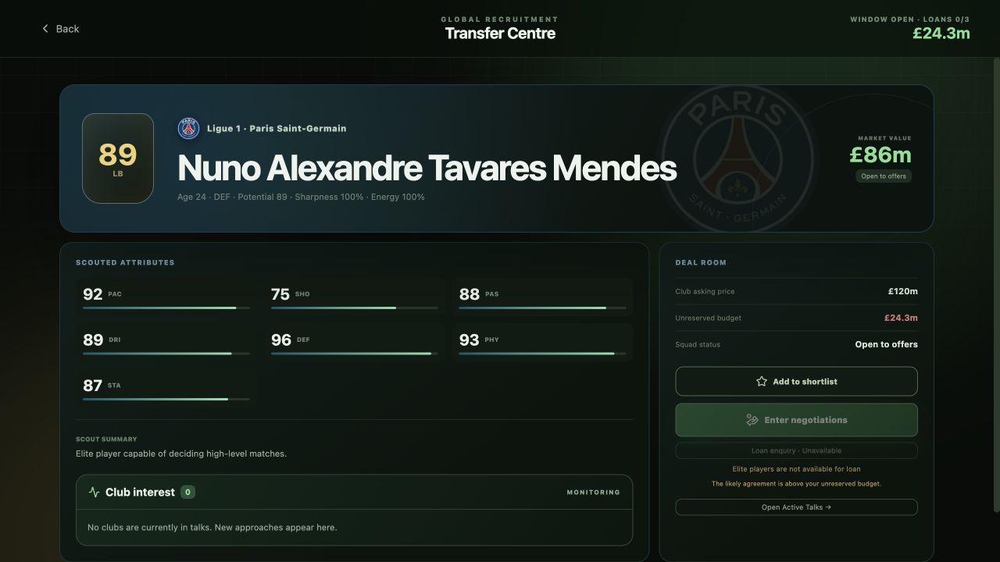</a>
<p><strong>Player scouting &amp; Club interest</strong><br />Compare attributes, affordability and approaches before committing. <a href="#transfers-and-the-intelligent-market">Read the recruitment guide →</a></p>
</td>
<td width="50%" valign="top">
<a href="docs/screenshots/contract-negotiation.png">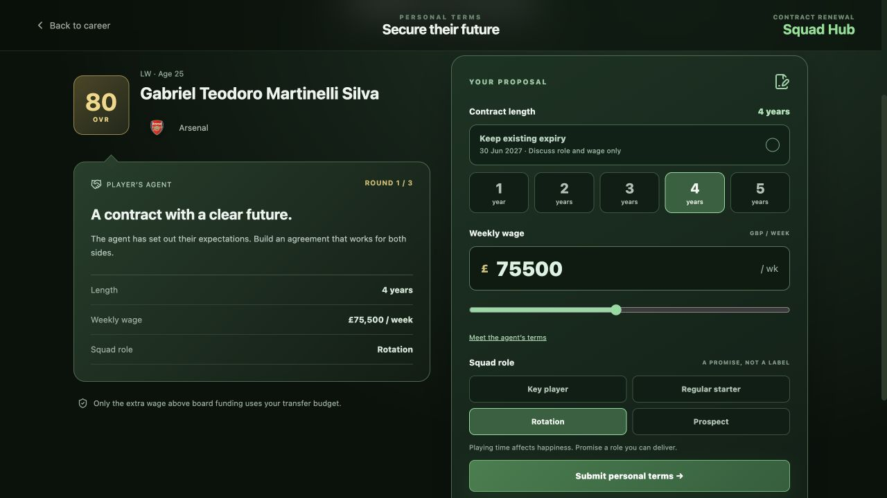</a>
<p><strong>Personal terms</strong><br />Discuss the length, wage and role—with funding visible before signing. <a href="#contracts-and-squad-role-negotiation">Follow the negotiation flow →</a></p>
</td>
</tr>
<tr>
<td width="50%" valign="top">
<a href="docs/screenshots/budget-overview.png">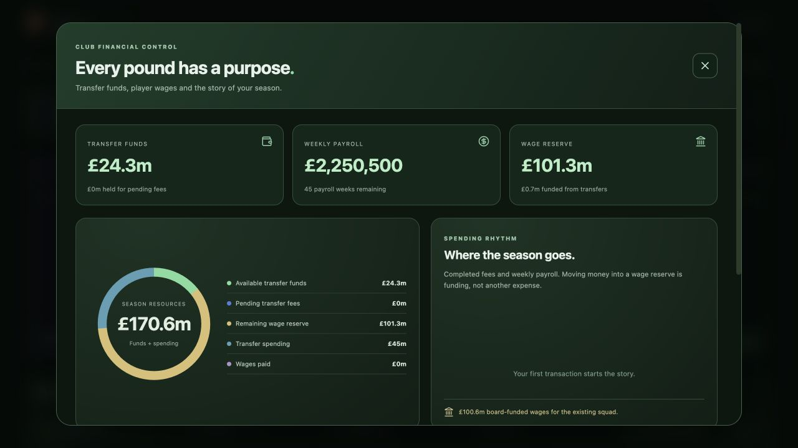</a>
<p><strong>Budget Overview</strong><br />Transfer cash, wage reserves and spending tell one financial story. <a href="#club-finances-and-competition-rewards">Understand the money →</a></p>
</td>
<td width="50%" valign="top">
<a href="docs/screenshots/board-objectives.png">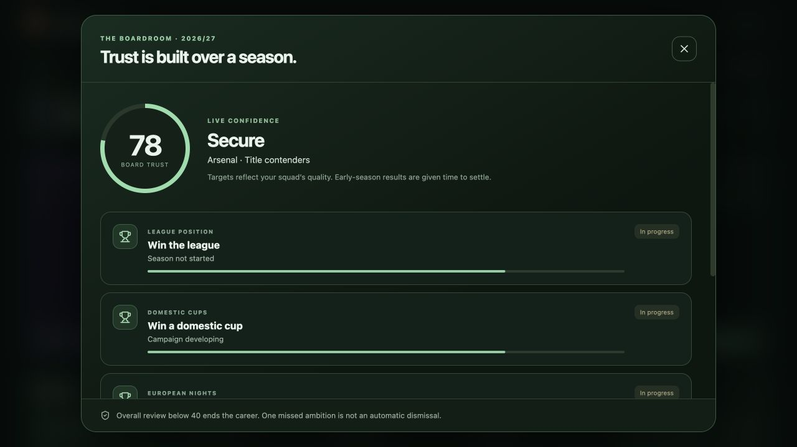</a>
<p><strong>The boardroom</strong><br />Live confidence and ambitions tailored to your team’s quality. <a href="#assistant-advice-and-board-objectives">Review the objectives →</a></p>
</td>
</tr>
</table>

## The connected career

There is one career state, not a disconnected save for every screen. A transfer changes the roster used in leagues and cups. A match changes energy, involvement, happiness and statistics. Advancing time recovers players, pays wages and processes negotiations.

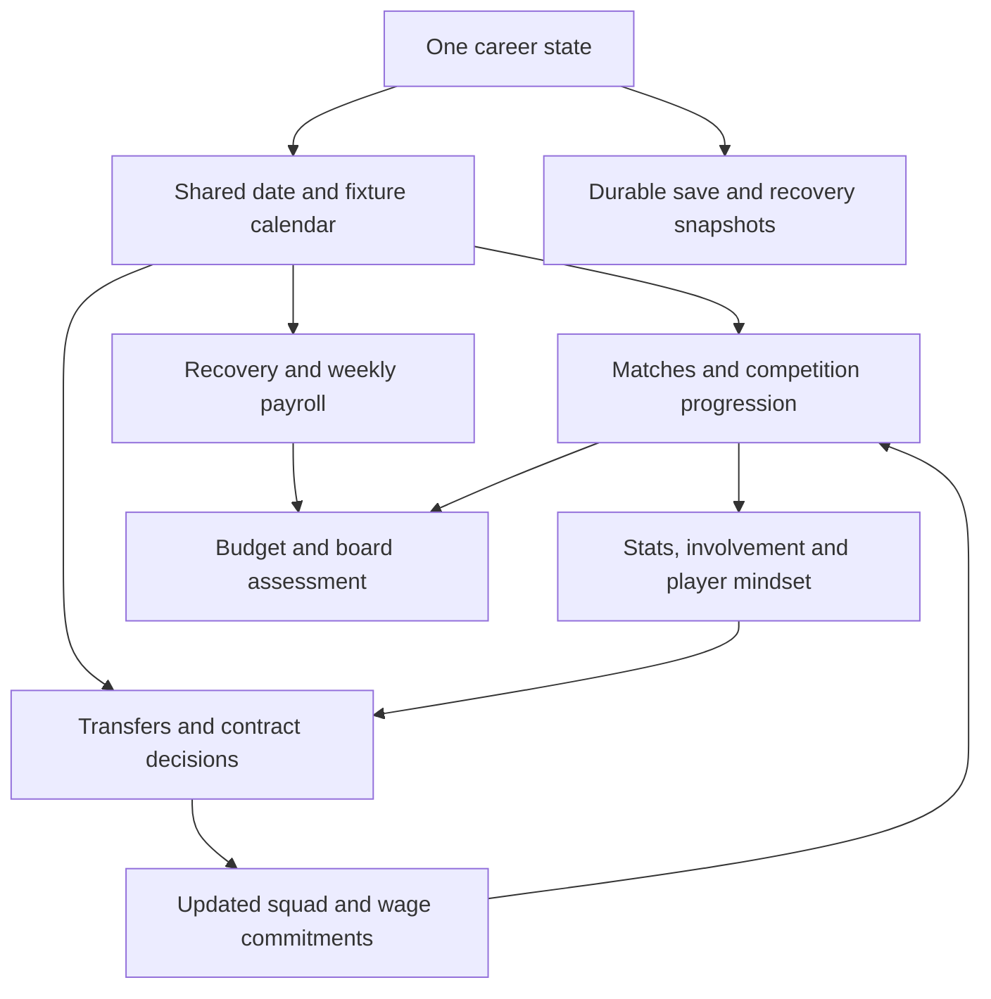
```mermaid
flowchart TD
    C["One career state"] --> D["Shared date and fixture calendar"]
    D --> M["Matches and competition progression"]
    D --> T["Transfers and contract decisions"]
    D --> F["Recovery and weekly payroll"]
    M --> P["Stats, involvement and player mindset"]
    P --> T
    T --> S["Updated squad and wage commitments"]
    S --> M
    F --> B["Budget and board assessment"]
    M --> B
    C --> V["Durable save and recovery snapshots"]
```

The full player guide is [GAMEPLAY.md](game-app/docs/GAMEPLAY.md). Exact formulas and source-module links are in [CALCULATIONS.md](game-app/docs/CALCULATIONS.md).

## World, competitions and calendar

### The football world

The bundled world contains **286 clubs and 6,473 unique player slugs**, including **70 European guest clubs**.

| Playable top flight | Clubs | Domestic competitions | Supported second-tier pool |
| --- | ---: | --- | --- |
| Premier League | 20 | FA Cup, Carabao Cup | Championship |
| LaLiga | 20 | Copa del Rey | Spanish second division |
| Serie A | 20 | Coppa Italia | Serie B |
| Bundesliga | 18 | DFB-Pokal | German second division |
| Ligue 1 | 18 | Coupe de France | French second division |
| Liga Portugal | 18 | Portuguese cup | No playable second tier |

Europe includes **Champions League, Europa League and Conference League**, with qualification, league-phase records, draws, knockout fixtures and separate calendar windows.

### Campaigns and progression

- League standings update from simulated results, supporting qualification and promotion/relegation.
- Domestic cup paths use dated rounds, draws and supported single-/two-leg tie rules.
- European knockout ties retain leg scores and aggregate context. Future winners/draw information are not revealed early.
- Deciding ties can require extra time and a penalty shootout.
- Competition Centre shows your next opponent, progress and campaign record. Active campaigns appear above eliminated/not-qualified ones.
- Advancement can trigger prize funding and a reward letter independently of visiting the result screen.

### One chronological queue

Calendar shows league, domestic cup and European fixtures together, plus transfer-window boundaries. The next event is chosen by date; opening a competition screen does not let you play it early.

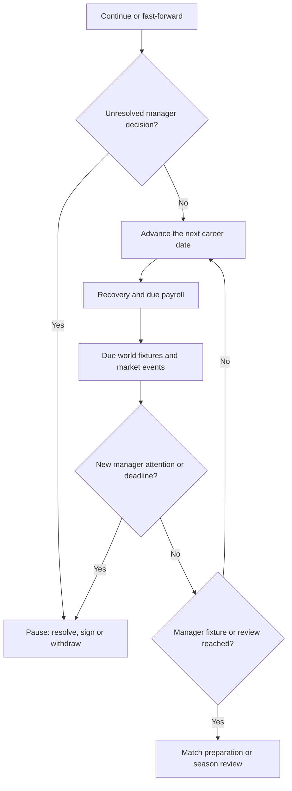
```mermaid
flowchart TD
    A["Continue or fast-forward"] --> G{"Unresolved manager decision?"}
    G -->|Yes| X["Pause: resolve, sign or withdraw"]
    G -->|No| D["Advance the next career date"]
    D --> R["Recovery and due payroll"]
    R --> W["Due world fixtures and market events"]
    W --> E{"New manager attention or deadline?"}
    E -->|Yes| X
    E -->|No| Q{"Manager fixture or review reached?"}
    Q -->|Yes| S["Match preparation or season review"]
    Q -->|No| D
```

Stops include relevant received offers, rival bids, signing decisions, ready personal terms, player-care attention, loan returns and Deadline Day. Background deals elsewhere do not all interrupt your career. Handled events and consumed dates are not repeatedly replayed.

## The management dashboard

### Five-tile season bar

Desktop order is **Season → Budget → Board objectives → Squad readiness → League form**. The strip wraps on smaller screens instead of squeezing five unreadable tiles together.

[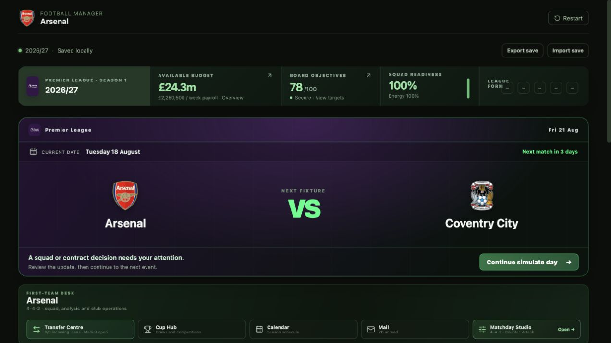](docs/screenshots/career-dashboard.png)

| Tile | Information | Interaction |
| --- | --- | --- |
| Season | Competition, season number and year | Career context |
| Budget | Available unreserved funds; fee reservations or weekly payroll | Opens Budget Overview |
| Board objectives | Confidence out of 100 and support status | Opens targets and assessment |
| Squad readiness | Average sharpness, plus energy separately | At-a-glance condition |
| League form | Last five league results | Received-offer shortcut when relevant |

Money is formatted cleanly—**£14.3m**, not floating-point decimal noise.

The first-team desk opens Transfer Centre, Cup Hub, Calendar, Mail and Matchday Studio. Workspace tabs provide Squad, Performance, Squad Hub, Table, Fixtures, Competitions, Calendar and Mail. Assistant recommendations appear when actionable.

## Squad selection, tactics and team sheets

### Your matchday squad

The main Squad screen keeps the pitch on the **left** and player groups on the **right**. Team-sheet selectors sit below the left pitch.

| Group | Meaning |
| --- | --- |
| Starting XI | Eleven assigned pitch positions |
| Bench | Up to nine explicitly selected substitutes |
| Available | Other players outside the selected matchday squad |

Drag players into positions or use **Start**, **Bench** and **Available** controls. Shirt-number editing is separate from selection. Injury/suspension markers explain unavailability.

Primary/registered secondary roles receive natural fit; unfamiliar roles carry a visible match-OVR penalty. Owning a player does not automatically put them on the selected bench.

### Matchday Studio and tactics

Studio combines the formation pitch, squad profile and panels for selection, tactics and team sheets. The squad profile highlights attacking/midfield/defensive strength, depth and formation trade-offs.

**Seventeen formations:** 4-3-3, 4-4-2, 4-2-3-1, 3-5-2, 3-4-3, 5-3-2, 4-3-1-2, 4-1-4-1, 4-2-2-2, 4-2-4, 4-4-1-1, 4-5-1, 4-3-2-1, 3-4-2-1, 3-4-1-2, 5-2-1-2 and 5-4-1.

| Style | Identity and trade-off |
| --- | --- |
| Balanced | Stable setup without extreme attack/defence modifiers |
| Tiki-Taka | Possession/control; depends on quality against deep blocks |
| Gegenpressing | Pressure and attacking output, with greater workload/transition risk |
| Park the Bus | Defensive protection at the expense of attacking threat |
| Counter-Attack | Absorb pressure and exploit opponents committing forward |
| Direct Play | Early forward progression, with less midfield buildup |

Set defensive line, aggression, offside trap, half-time style response and automatic substitutions. Opponents also have tactical identities; the whole AI field is not simply Balanced.

### Three complete team sheets

Keep up to **three named sheets**, starting with **Team XI**. Each stores formation, pitch assignments, bench, playing style, defensive settings, half-time response and auto-sub preference.

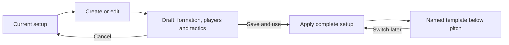
```mermaid
flowchart LR
    A["Current setup"] --> B["Create or edit"]
    B --> C["Draft: formation, players and tactics"]
    C -->|Cancel| A
    C -->|Save and use| D["Apply complete setup"]
    D --> E["Named template below pitch"]
    E -->|Switch later| D
```

Drag/swap players inside the draft or select a pitch slot then a player. Names must be distinct, all eleven starters must be selected, and at least one sheet must remain.

Explicit manager edits sync to the active template. Temporary injury replacements and match substitutions **do not overwrite your saved plan**. Activating a sheet fills unavailable/departed positions with eligible replacements without deleting the stored template. Instant simulation uses a readiness-aware XI and restores strong recovered players instead of permanently benching them.

## Match simulation, fatigue and substitutions

### What decides a match?

Results come from football events, not a chosen score decorated afterward. Ability, position fit, sharpness, energy, formation, tactics, home advantage and match events all contribute.

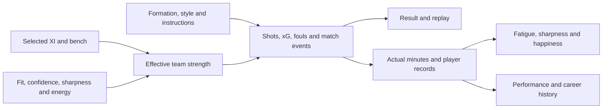
```mermaid
flowchart LR
    S["Selected XI and bench"] --> Q["Effective team strength"]
    P["Fit, confidence, sharpness and energy"] --> Q
    T["Formation, style and instructions"] --> E["Shots, xG, fouls and match events"]
    Q --> E
    E --> R["Result and replay"]
    E --> U["Actual minutes and player records"]
    U --> F["Fatigue, sharpness and happiness"]
    U --> C["Performance and career history"]
```

Match OVR includes confidence, bounded −2 to +2. Effective ability then accounts for readiness and assigned position. Tactics have matchup advantages/risks; neither the highest OVR nor a particular style guarantees victory.

### Live activity and records

Replay shows named goals/assists, cards, injuries, tactics changes and **substitution on/off** events. Supporting information includes possession, shots, expected goals, momentum and detailed player/team records. Results feed per-competition statistics, season averages and awards.

Shootouts compare takers with the opposing keeper: five kicks, paired sudden death if needed, and a bounded fallback to prevent an endless tie.

### Energy is not sharpness

| Measure | Improves when | Falls when |
| --- | --- | --- |
| Energy | Career-day recovery/rest | Playing minutes and demanding tactics |
| Fitness / match sharpness | Useful match minutes | Repeated inactivity |
| Confidence | Recent performance | Poor performance and gradual return toward baseline |

A player can be sharp but tired, or rested but lacking rhythm. Useful minutes build sharpness; playing repeatedly does not reduce sharpness merely because the player played.

Both sides retain updates. Opponents do not automatically return to 100% before every fixture. Workload reflects stamina, role, minutes and style; keepers carry a lighter energy load.

### Substitutions, injuries and suspensions

Both teams can substitute tired/injured players from their selected bench. Automatic checks run around **55, 70 and 80 minutes**, with at most **five substitutions** overall; injury replacements share that allowance. Actual substitute minutes feed workload/statistics.

A red card removes a player without replacement. A tactical substitution of another player can restore positional coverage, not an eleventh player. Injuries/suspensions prevent selection until eligibility returns and do not count as intentional playing-time snubs.

## Performance Centre and Squad Hub

### Performance Centre: what happened on the pitch?

Records start with fixtures played/simulated in **this career**. Search names, filter competition and exact/secondary position, and sort ascending/descending by:

- Name, position and OVR.
- Appearances, goals, assists and clean sheets.
- Yellow/red cards.
- Average and best rating.

Players without ratings stay below rated players in either direction. Global leaders, awards and season-XI analysis use career records too.

### Squad Hub: who is the player and what do they need?

A searchable/scrollable player list sits on the left; selecting a player opens the profile on the right.

| Area | Information |
| --- | --- |
| Identity | Name, OVR, positions, age, value and available source profile facts |
| Player DNA | Five-axis attribute pentagon, with keeper-specific labels where appropriate |
| Readiness | Energy and sharpness |
| Mindset | Happiness, ambition and concern/status |
| Contract | Expiry, remaining length, wage, promised role and source attribution |
| Actions | Contract talks plus compact Sell/Loan controls |
| Club interest | Approaching clubs, bids and phases |
| Playing-time tracker | Starts, subs, minutes, useful involvement and patience gates |
| Career record | Season/club apps, minutes, goals, assists, average and best rating |

Career rows contain **in-game simulated data only**. Transfers create separate club stints; real-world goal/rating histories are not copied into your save. Legacy minute logs retain known minutes without inventing missing start/sub classifications.

## Transfers and the intelligent market

### Discover and monitor players

Transfer Centre supports player/club search, league/club filters, precise/secondary positions, age range, market value, sorting and shortlists. Search **free agent** or **free agents** to browse unattached players.

Profiles separate **market value** from **asking price**. Importance/availability labels explain open offers, key players, protected prospects, cornerstones and release restrictions.

**Club interest** summarizes the race. **Active Talks** groups your negotiations, market-wide approaches and recent decisions. Neither is a guarantee of completion.

### Buying flow

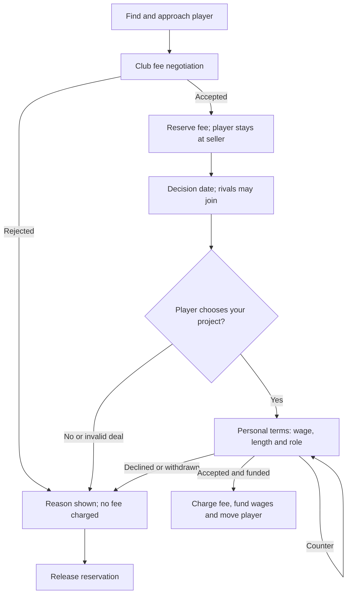
```mermaid
flowchart TD
    A["Find and approach player"] --> B["Club fee negotiation"]
    B -->|Rejected| Z["Reason shown; no fee charged"]
    B -->|Accepted| R["Reserve fee; player stays at seller"]
    R --> C["Decision date; rivals may join"]
    C --> V{"Player chooses your project?"}
    V -->|No or invalid deal| Z
    V -->|Yes| P["Personal terms: wage, length and role"]
    P -->|Counter| P
    P -->|Declined or withdrawn| Z
    P -->|Accepted and funded| F["Charge fee, fund wages and move player"]
    Z --> X["Release reservation"]
```

Club talks allow up to three rounds. Accepted fees remain reserved until personal terms complete. Normal user decisions resolve after about two career days, shortened near the deadline.

Players compare valid projects: club quality, expected opportunities, Europe, simulated terms and stable preference variation. A **sole suitable accepted bid has no arbitrary 1% refusal roll**. Ambitious young stars may still reject a clearly weaker project, and a happy unlisted player being sold may prefer to stay.

A rival can win before final completion. Changed capacity, money, seller depth, active loans or ownership can invalidate a pending deal. Failure notices identify the real blocker and release funds.

### Transfer pricing and negotiation

Valuation begins with market value and a **1.02 base multiplier**, adjusted for rating, age, potential, squad importance, seller strength, positional depth, form and small stable variation.

| Factor | Effect |
| --- | --- |
| Rating / importance | Higher asking price and firmer negotiation |
| Youth / strong potential | Premium |
| Older age | Lower premium |
| Thin positional depth | Release restrictions and extra price pressure |
| Contract ≤12 / ≤24 months | Multiplier .78 / .90 |
| Wants move, otherwise longer contract | Multiplier .90 |
| Illegal/depleted squad after release | Cannot sell regardless of fee |

Matching asking price is accepted if otherwise valid. Offers at the seller's lower acceptable threshold use a probability; very low bids/failed final rounds end talks. Fees normalize to **£100k**, whereas wage funding preserves whole pounds. [Every premium and formula](game-app/docs/CALCULATIONS.md#transfer-fee-valuation) is documented separately.

### AI recruitment: needs plus budgets

Clubs assess actual roles in their preferred formation: missing starters, serious injury cover, weak-position upgrades, ageing/expiring-player succession, backups and prospects. A strong, well-covered midfield should not buy another expensive star just to create activity.

| Window | Behaviour |
| --- | --- |
| First summer | Configured opening replay, not unrestricted random recruitment |
| Later summers | More upgrades, succession, depth and prospects |
| January | Quieter; urgent injury cover, missing starters or relegation danger |

Recruitment follows a three-day summer/seven-day January pattern, considering up to 32/10 clubs per tick. Clubs are limited to three summer/one winter signings or pending talks. Their most urgent needs are tried before abandoning unaffordable targets.

Single-deal spending is capped at **80% of club funds**, a quality ceiling and actual unreserved cash:

| Club quality | ≥84 | ≥81 | ≥78 | ≥75 | ≥72 | ≥68 | Lower |
| --- | ---: | ---: | ---: | ---: | ---: | ---: | ---: |
| Quality cap | £180m | £100m | £65m | £38m | £20m | £9m | £3m |

Completed buys/sales change budgets. This is not a full profit-and-loss model for every AI club.

### Opening-window replay

Configured moves include Sávio, Baleba, Bouaddi, Delap, Jackson, Martínez, Enzo Fernández and Adarabioyo. These are **stored simulation events**, not a fresh certification of transfer news. Dates/source references live in the opening-transfer module; fees are game valuations.

Starting rosters remain unchanged. The calendar creates approaches/invitations and moves players through the market. Managed sellers get approval-required offers; managed buyers get invitations without automatic spending. Already-moved/unavailable/loaned players are not forced into duplicate deals. Events are consumed once.

### Selling and incoming offers

Clubs can approach listed or unlisted players. You approve/counter/reject the fee; the player remains available during talks. Normal buyers can afford negotiation toward market value instead of trapping a valuable player with an impossible low ceiling.

After approval, AI personal talks usually take **1–3 days**. Accept multiple fees if desired: the player chooses the best valid project, and only the winner pays. Money arrives on completion, not listing/first acceptance.

Formal requests can attract offers outside a window. Closed-window agreements wait for the next opening; the player stays with you until registration.

### Loans and free agents

| System | Rules |
| --- | --- |
| Incoming loans | Availability/fee checks; maximum three |
| Outgoing duration | 0.5–3 seasons in half-season steps |
| Loan return | Dated January/June boundaries; no duplicate return |
| Recall | Compensation: min(£2m, max(£0.1m, value × 5%)); can occur outside window |
| Loan protection | Elite/core/protected players may be unavailable; active loans block permanent moves |
| Loan wages | Paid by owner; wage-sharing negotiation not implemented |
| Free-agent entry | Expired unrenewed contracts; AI can decline to renew ageing low-upside depth |
| Free-agent signing | Direct personal terms, including outside window; no fee but funded wages/capacity required |

Suitable AI clubs can sign free agents. Released players are not guaranteed a destination, and ambitious free agents can reject a project below their level.

## Contracts and squad-role negotiation

### Starting data and generated terms

The [FUTWIZ FC26 snapshot](game-app/src/data/CONTRACTS.md) confidently matches **5,182 of 6,473 unique roster player slugs**, supplying expiry year, weekly GBP wage and optional profile/attribute fields. Expiry maps to **30 June** because the source gives a year, not a precise day.

| Origin | Meaning |
| --- | --- |
| Source FC26 | Attributed database wage/expiry, not current legal verification |
| Simulated terms | Generated starting contract for an unmatched player |
| Career agreement | Negotiated terms in this save |

Unmatched terms use club finances, age, OVR and potential. Older players (outfield ≥32 / GK ≥35) get one year; others two/three. Young low-upside players get lower wages. Starting estimated wages round to £500 and range £500–£250k/week. Generated youth receive three years, £1k/week and Prospect.

Sourced already-ended terms are not silently extended. Initial squad roles are inferred separately from sourced wage/expiry.

### Personal terms

Negotiate **weekly wage, length and role** with the agent. New signings require 1–5 whole years. Higher OVR increases demand; age affects wages and preferred length.

Counters persist and reset the wage field to the agent's current request. **Meet the agent's terms** applies the proposal directly. Maximum three rounds; extra money cannot bypass an unacceptable role promise.

Acceptance generally requires at least **95% of demanded wage**, acceptable duration and a role at/above required status. Even accepted terms cannot complete without enough wage funding while the fee remains reserved.

### Renewal versus keeping the expiry

Ordinary renewal opens in the final **24 months**. Newly signed contracts settle for **180 days**. Wanting-move players or ambitious young stars far above a weak club's level can refuse.

To change the role without adding years, select **no extension / keep current expiry** inside negotiation. There is no instant role-changing dropdown.

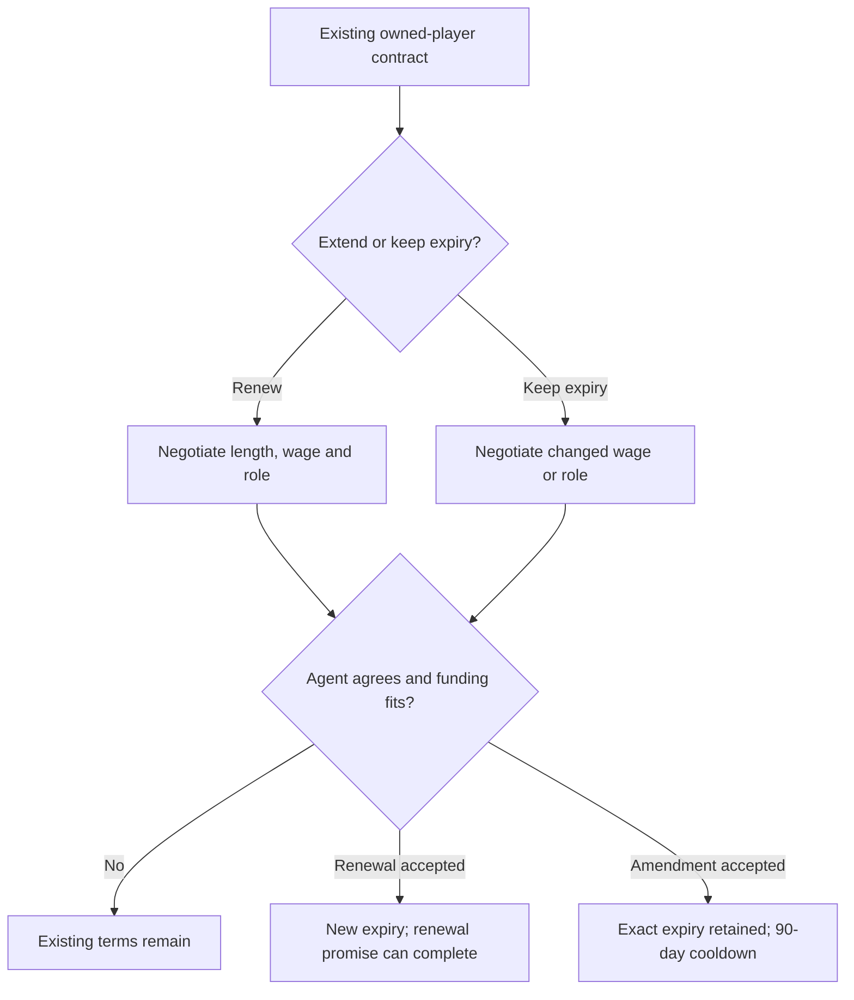
```mermaid
flowchart TD
    A["Existing owned-player contract"] --> B{"Extend or keep expiry?"}
    B -->|Renew| C["Negotiate length, wage and role"]
    B -->|Keep expiry| D["Negotiate changed wage or role"]
    C --> E{"Agent agrees and funding fits?"}
    D --> E
    E -->|No| F["Existing terms remain"]
    E -->|Renewal accepted| G["New expiry; renewal promise can complete"]
    E -->|Amendment accepted| H["Exact expiry retained; 90-day cooldown"]
```

Amendments retain expiry/original signing date and involvement history. At least wage or role must change. They cannot apply to new incoming signings or satisfy a promised extension. High-rated/important players protect status; lower-rated depth or suitable backup keepers may agree to a smaller role.

## Playing time, happiness and player meetings

### Expectations are visible

The tracker shows starts, subs, minutes, meaningful appearances and consecutive missed involvement alongside the contract role. Warning/request gates include both matches and days, not a hidden timer.

**Both gates must be met.** A formal request additionally requires happiness **≤35**.

| Role | Warning | Formal request | Useful appearance |
| --- | --- | --- | ---: |
| Key player | 3 eligible missed matches **and** 21 days | 10 matches **and** 56 days | ≥36 minutes |
| Regular starter | 10 matches **and** 42 days | 24 matches **and** 112 days | ≥28 minutes |
| Rotation | 16 matches **and** 70 days | 36 matches **and** 180 days | ≥15 minutes |
| Prospect | 18 matches **and** 180 days | Never for playing time | ≥15 minutes |

Meaningful minutes reset the streak/day clock. Token late cameos do not necessarily satisfy key-player expectations. Injury/suspension/loan absence pauses patience, including the return interval.

### Reserve goalkeepers

A non-key keeper with another higher-ranked keeper at the club receives reserve-cover expectations **without changing the contracted role**. Tied ratings resolve consistently.

| Reserve GK role | Warning | Formal request |
| --- | --- | --- |
| Regular starter | 14 matches and 84 days | 32 matches and 210 days |
| Rotation | 24 matches and 120 days | 52 matches and 270 days |
| Prospect | 24 matches and 270 days | Never for playing time |

Key keepers keep key expectations. A contractual role downgrade still needs an accepted negotiation.

### Happiness and escalation

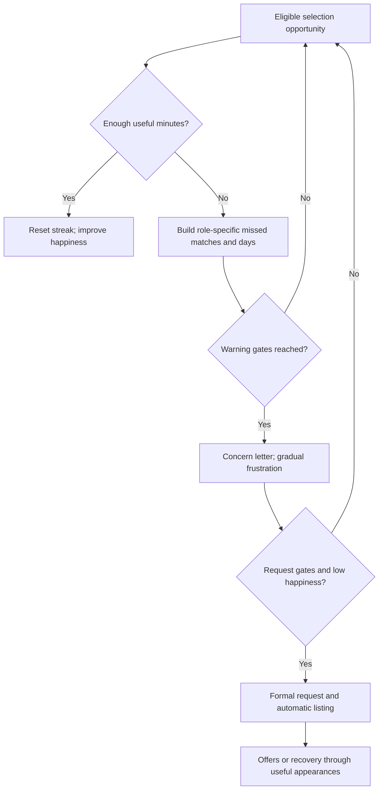
```mermaid
flowchart TD
    A["Eligible selection opportunity"] --> M{"Enough useful minutes?"}
    M -->|Yes| R["Reset streak; improve happiness"]
    M -->|No| P["Build role-specific missed matches and days"]
    P --> W{"Warning gates reached?"}
    W -->|No| A
    W -->|Yes| C["Concern letter; gradual frustration"]
    C --> T{"Request gates and low happiness?"}
    T -->|No| A
    T -->|Yes| L["Formal request and automatic listing"]
    L --> S["Offers or recovery through useful appearances"]
```

Winning form halves normal playing-time drain: ≥4 recorded results and ≥60% wins among the last six. Regular/rotation players drain more slowly than key players. Prospects have a happiness floor and no forced playing-time request. Three consecutive meaningful appearances can resolve a request.

The game does not demand equal starts for thirty players. It does require honoring the different statuses promised in contracts.

### Player meetings through Mail

Letters show the player card, concern and live happiness. Scroll to reach responses. Each letter can be answered once; player replies make consequences visible.

| Choice / event | Consequence |
| --- | --- |
| Rest reassurance | Small morale benefit; no selection promise |
| Promise minutes | Immediate benefit plus tracked obligation |
| Challenge | Happiness cost |
| Suitable youth-loan suggestion | Positive response where eligible |
| Promise renewal | New agreement required within 30 days |
| Successful prospect loan | Separate thank-you letter can arrive |

A minutes promise requires **two ≥25-minute appearances in the next five eligible matches**. Injury/suspension pauses it. Kept/broken promises affect happiness; a new promise cannot overwrite an active obligation.

Happy near-expiry players can invite renewal. Formal requests send distinct mail and can produce off-window future transfers. Without a renewal/transfer before expiry, the player becomes unattached.

## Club finances and competition rewards

### Transfer money versus wage funding

The initial transfer budget does not also fund the entire existing squad's wage bill. The board provides separate wage allocation at season setup. New signing wages/renewal increases move their remaining-season cost from transfer funds into wages.

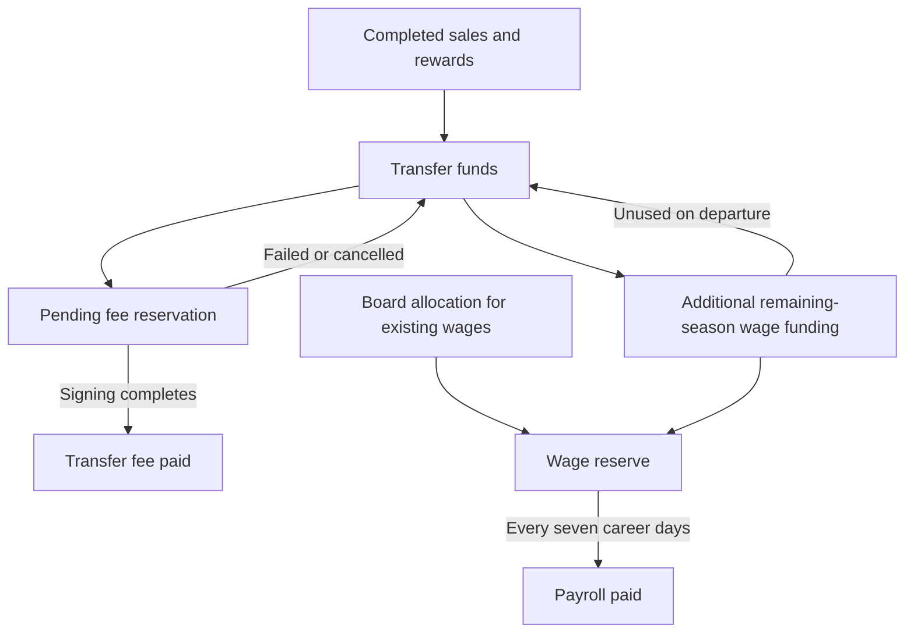
```mermaid
flowchart TD
    B["Transfer funds"] --> R["Pending fee reservation"]
    R -->|Signing completes| F["Transfer fee paid"]
    R -->|Failed or cancelled| B
    B --> W["Additional remaining-season wage funding"]
    A["Board allocation for existing wages"] --> P["Wage reserve"]
    W --> P
    P -->|Every seven career days| X["Payroll paid"]
    W -->|Unused on departure| B
    S["Completed sales and rewards"] --> B
```

**Available = transfer budget − pending fees**, with displayed available cash floored at zero. A reservation is not spending and does not move the player.

```text
Required transfer-funded wages
  = max(0, new weekly wage − board-funded weekly wage)
    × remaining payroll weeks this season

Transfer-budget change
  = required wage funding − existing player wage funding
```

Incoming players have no existing board wage allocation, so their full remaining-season commitment is funded. Renewals fund the increase above board allocation; reduced commitments can release unused funding.

**Example: £50m available, £40m fee, £100k/week for 40 weeks.**

| Step | Transfer funds | Meaning |
| --- | ---: | --- |
| Before agreement | £50m | Available |
| Fee reserved | £10m unreserved | £40m pending, not charged |
| Terms funded | £6m unreserved | £4m moved into wages |
| Signing complete | £6m balance | Fee paid; wage reserve funded |
| Each payroll week | No second £100k transfer charge | Payroll consumes wage reserve |

Payroll uses **career days**, not real-world weeks. Paid dates do not double charge. Permanent departures return unused transfer-funded reserve; board-funded money is not a transfer windfall. New seasons allocate fresh board wage funding.

### Budget Overview

Press Budget for available cash, fee reservations, wage commitments/reserves, spending, a resource/allocation chart, trend and category-filtered ledger.

The chart is not real total club wealth. Wage allocations are pool movements; paid payroll is expenditure. Counting both as spending duplicates money.

### Competition rewards

Rewards are modest **game-balanced allocations**, not an official FC27 payout table or full real-world TV/prize model. Each season/competition/milestone pays once on actual qualification, with mail and ledger entries.

| Milestone | Champions League | Europa League | Conference League |
| --- | ---: | ---: | ---: |
| Knockout playoffs | £0.5m | £0.25m | £0.1m |
| Round of 16 | £0.8m | £0.4m | £0.2m |
| Quarter-final | £1.5m | £0.6m | £0.3m |
| Semi-final | £2m | £1m | £0.5m |
| Final | £3m | £1.5m | £0.8m |
| Champions | £5m | £2.5m | £1.2m |

Top-eight league-phase teams receive R16 funding directly; playoff teams earn R16 funding after qualifying through their tie. First-leg wins, byes, defeats or repeat screen visits do not pay again.

Domestic allocations range from £120k Fourth Round to £2m champions in FA Cup, £25k R32 to £500k champions in Carabao, and £40k R32 to £1m champions in other supported cups. [All domestic amounts](game-app/src/data/REWARDS.md) are documented.

Premier League merit funding arrives **next season**: £1m × (21 − final position), from £20m first to £1m twentieth, plus board allocation (£10m, or £6m if relegated). Other leagues/tiers use documented position-based grants. Existing cash carries forward.

## Assistant advice and board objectives

### Advice based on your current situation

The assistant can highlight:

- A minutes promise needing another useful appearance.
- A tired starter with a rested natural-position replacement.
- A happy valuable player approaching expiry.
- A short turnaround and saved cup/rotation sheet.
- An out-of-position starter or tactical risk before the next opponent.

At most three priorities appear. Select anywhere on a notebook card to open its action, or focus it and press Enter or Space. Suggestions require your action; advice does not silently renegotiate or rewrite tactics.

### The board's season mandate

Board objectives sits beside Budget and opens the full report. Targets depend on top-eleven quality and relative league strength, not just club names.

| Category | League | Domestic cup | Europe, if qualified |
| --- | --- | --- | --- |
| Elite: quality ≥84, strength rank ≤4 | Winner | Winner | UCL winner; other Europe quarters |
| Contender: otherwise quality ≥80 or rank ≤5 | Top four | Semi-final | Quarter-final |
| Upper-half / rebuilding | Top half | Quarter-final | Round of 16 |
| Lower-ranked | Survival | Quarter-final | Round of 16 |

Finance asks for sustainably funded wages. Scores give partial credit and soften early-season results; the first defeat does not decide your job.

Weights: league **50**, domestic **25**, Europe **20 if present**, finance **15**, divided by the actual total. Domestic assessment uses best supported cup progress.

| Confidence | Status |
| --- | --- |
| ≥70 | Secure |
| ≥55 | Supported |
| ≥40 | Under review |
| <40 | At risk |

Only **final overall confidence below 40** dismisses the manager. One missed target is not a separate instant loss; cup/financial success can offset league disappointment. Final review is recorded once, and tile/modal share its report.

## Deadline Day

First-summer deadline: **1 September 2026**. Later summers: **31 August**. January: **31 January**. Calendar markers and transfer permissions share these dates.

The date stays fixed while a **20-hour game clock** runs. Advance one/two hours, handle decisions and return to market, offers, mail or personal talks.

- A two-hour advance stops early for a decision due in the first hour.
- Ready terms/unread signing decisions must be handled before more time passes.
- Later-window recruitment/approaches can run at fifth-hour checkpoints.
- Hour 20 closes new club bids and unlocks normal date progression.
- Previously agreed fees can finish personal terms; free-agent approaches remain available.

This is not a real-time countdown. Leaving the browser open does not consume negotiation hours.

## Season progression

Complete campaigns and final review before rollover. History remains while the next season is prepared.

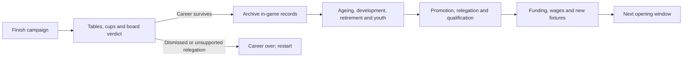
```mermaid
flowchart LR
    A["Finish campaign"] --> B["Tables, cups and board verdict"]
    B -->|Career survives| C["Archive in-game records"]
    C --> D["Ageing, development, retirement and youth"]
    D --> E["Promotion, relegation and qualification"]
    E --> F["Funding, wages and new fixtures"]
    F --> G["Next opening window"]
    B -->|Dismissed or unsupported relegation| H["Career over; restart"]
```

Players age one year. Youth development uses age, potential and appearances; regularly used under-24 players can grow while below potential. Older players may decline/retire. Values adjust with growth/decline; youth intake respects space and goalkeeper coverage.

Season stats/confidence/readiness reset; archived career rows remain. Qualification/promotion/relegation use completed outcomes. Dropping below a supported second tier ends the career rather than inventing another league.

## Loading, saves, recovery and restart

### Clear loading and failure states

A lightweight HTML screen appears before the game modules finish loading. React continues the same visual while restoring progress. Reduced-motion preferences are respected; there is no fake percentage or artificial minimum delay.

Module/render failures offer **Reload game**, not an unexplained blank page. This does not clear storage or replace corrupt saves. It improves feedback, not synchronous validation speed, and adds no general network timeout.

### Durable local saves

IndexedDB keeps current/recovery snapshots, with localStorage fallback where possible. JSON export/import provides portable backup. Import validates contracts, talks, player logs, finance and other saved fields before applying them.

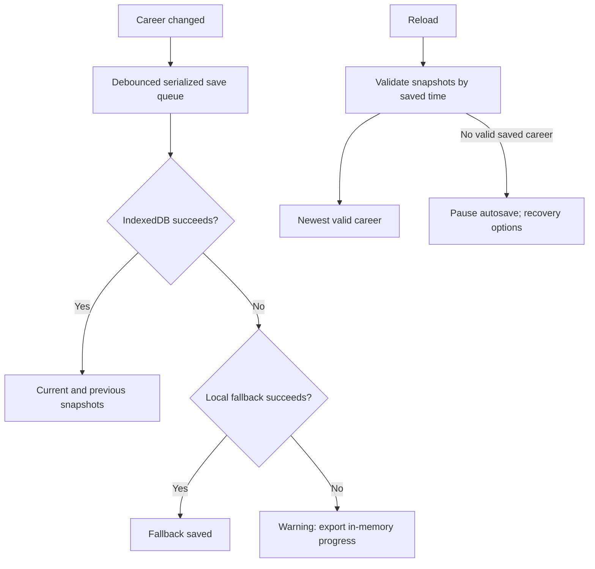
```mermaid
flowchart TD
    S["Career changed"] --> Q["Debounced serialized save queue"]
    Q --> I{"IndexedDB succeeds?"}
    I -->|Yes| D["Current and previous snapshots"]
    I -->|No| L{"Local fallback succeeds?"}
    L -->|Yes| F["Fallback saved"]
    L -->|No| W["Warning: export in-memory progress"]
    R["Reload"] --> V["Validate snapshots by saved time"]
    V --> C["Newest valid career"]
    V -->|No valid saved career| E["Pause autosave; recovery options"]
```

Schema **8** supports older migrations. Compaction deduplicates roster data and omits transient replay blobs. Autosaves debounce **500ms**; signings/completed instant batches await storage. Repository timestamps remain monotonic.

Export before refreshing if storage is full/progress is unsaved. Corrupt careers are not automatically overwritten. Different browser origins have separate saves; changing host/port can look like missing progress.

### Restart from the beginning

Restart opens a confirmation with **Export backup**, **Keep playing** and **Restart career**. Opening/cancelling it changes nothing.

Confirmation persists the fresh start before league selection, replaces current/recovery career data, updates only this game's legacy keys, clears workspace/drag/filter state and prevents old queued saves or delayed imports/simulations from restoring the old career.

If both stores fail, the current in-memory career stays open with retry/export guidance. Unrelated storage is not cleared. Fresh date/window/deadline checks work before choosing a club.

> A confirmed restart replaces the active save. Export first if you want to restore the old career later. Refresh afterward should show league selection, not your previous team.

## Development and documentation

### Repository layout

```text
README.md                          Complete system introduction
docs/assets/                       Local README banner and badges
game-app/
  README.md                        Developer guide and invariants
  index.html                       First-paint loading screen
  src/
    bootstrap.js, main.jsx         Loading and React entry
    App.jsx                        Screens and manager actions
    game/                          Rules, calendars and storage
    components/                    Workspaces and match UI
    data/                          Rosters, contracts and provenance
    assets/                        Club and competition branding
  docs/
    GAMEPLAY.md                    Player-facing workflows
    CALCULATIONS.md                Exact formulas and thresholds
  tests/                           Game-rule regressions
```

### Verification

From game-app:

```sh
node --test --test-reporter=spec tests/*.test.mjs
npm run lint
npm run build
```

At this audit **138 tests pass**, covering chronology, competitions, transfers, player choice, contracts, amendments, wages, emotions/promises, keeper patience, free agents, sheets, rewards, board review, deadlines, recovery and restart races. Browser QA uses isolated test origins, not a player's live save.

The roster/contract bundle is large; Vite may report a chunk-size warning despite a successful build. The loader improves feedback, not download/parse cost. Local SVG badges are an audited snapshot, not a live CI badge.

### Documentation map

| Document | Purpose |
| --- | --- |
| [Gameplay guide](game-app/docs/GAMEPLAY.md) | Screen-by-screen workflows |
| [Calculation reference](game-app/docs/CALCULATIONS.md) | Major formulas, thresholds and owning modules |
| [Developer guide](game-app/README.md) | State invariants, persistence and commands |
| [Contract provenance](game-app/src/data/CONTRACTS.md) | Coverage, generated terms and policy |
| [Reward tables](game-app/src/data/REWARDS.md) | Exact progression/next-season allocations |
| [Club logos](game-app/src/assets/club-logos/SOURCE.md) / [competition logos](game-app/src/assets/competition-logos/SOURCE.md) | Preserved asset sources |

Update formulas and tests together when rules change; update the guide/README when behaviour changes. Preserve provenance instead of relabelling old downloads as newly verified.

### Scope and attribution

Not yet implemented: full club P&L (tickets/TV, staff/stadium), signing/agent bonuses, negotiated loan wage sharing, real legal registration rules or actual player personalities. AI finances do not have the managed club's complete wage ledger. Opening replay is configured data, not a continuously updated transfer-news feed.

Logos belong to their owners. Starting contract records are attributed FC26 data; generated terms, fees, rewards, emotions, board targets and match outcomes are simulation rules. External career-stat history is never presented as a result of this save.
